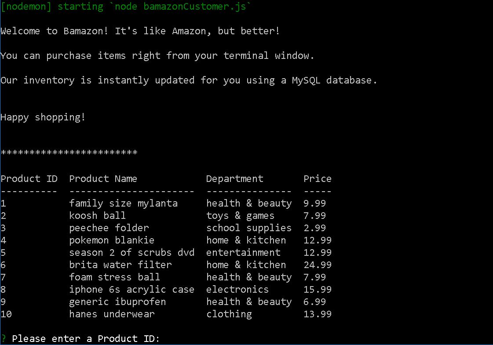
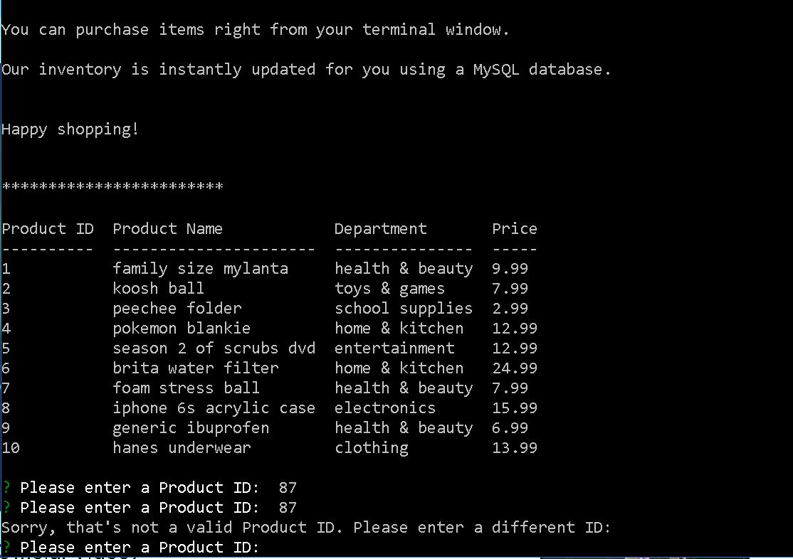
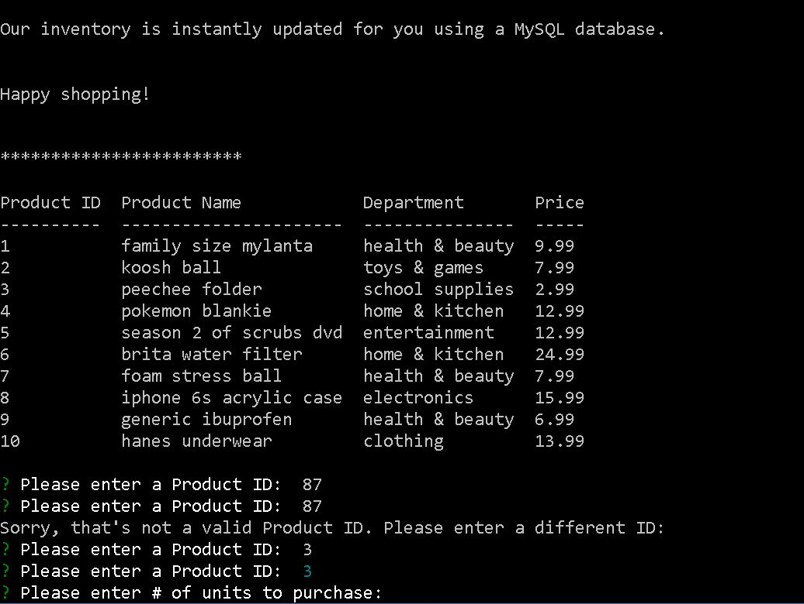
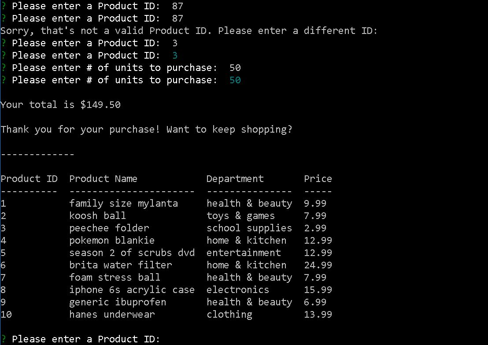

# bamazon
**An Amazon-like storefront utilizing a MySQL database**

Bamazon is an Amazon-like storefront with a MySQL database that stores product information. The app will take in orders from customers via the command line, and update stock accordingly from the store's inventory. 

The app also tracks product sales across each department and then provides a summary of the highest-grossing departments in the store.

## Get Started

1. Create a local clone of this github repo.
2. With your console application, navigate to the local repo's root folder.
3. Run `npm install`.
4. Run `node bamazonCustomer.js`.
5. Once the application loads, follow the directions on your console screen!

